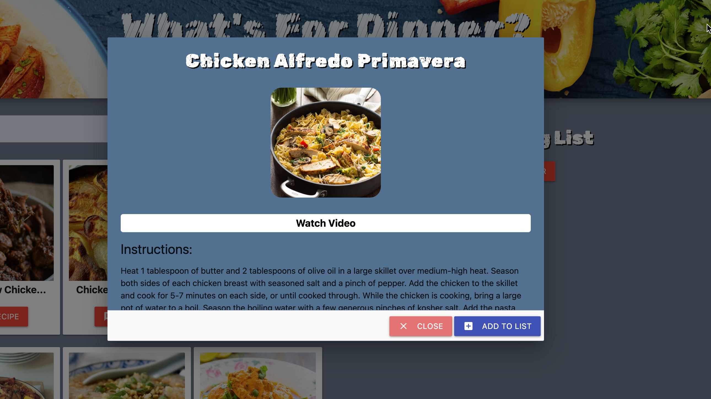

# 🥙 What's For Dinner? 🥙
Application to find and discover foods by certain criteria that the user decides. Ability to populate a shopping list for meal and get prices.

## Table of Contents 

- [Description](#description)
- [User Story](#user-story)
- [Acceptance Criteria](#acceptance-criteria-✅)
- [Mock-Up](#mock-up)
- [Data](#data)
- [Build](#build)
- [Setup](#setup)
- [Deployment Link](#deployment-link)
- [Tools](#tools-🔧)
- [Technologies](#technologies-💻)
- [Credits](#credits-©)

## Description
 Application where user can search random recipe by entering ingredient name. When user select any recipe from search results and add into list then user can able to see ingredients with price in shopping list.

## User Story

As a USER,  
I want to discover new meals based on search criteria and populate a shopping list with prices  
So that I can plan my meal for the day and the cost of the ingredients.  

## Acceptance Criteria ✅

GIVEN a Dinner Meal with form input  

WHEN I search for a meal  
THEN I am presented with options of meals including ingredients, an image, and sample instructions.  

WHEN I enter blank/incorrect meal name in search  
THEN Error message is displayed to User with empty search results.  

WHEN I select the meal that i want to choose  
THEN I will have the ingredients listed in a shopping list and the instructions to prepare in separate divs.  
And the meal is stored in local storage  

WHEN  the ingredients are listed  
THEN I am presented the price of the ingredients  

WHEN I click the add to cart button  
THEN I am presented with the ability to purchase the items from Kroger  

WHEN I Click the Random Meal button  
THEN a Random Meal is chosen and placed in the shopping list/instructions divs as well as local storage.  

WHEN I click the clear button  
THEN the meal is removed from local storage and I can start again.  

## Mock-Up

## Data

The application uses the following data inputs:

 - Meal recipe information is provided by TheMealDB API. Documentation can be found here. <a href="https://themealdb.com/"> TheMealDB </a>
 - Shopping list prices are provide by Kroger API. Documentation can be found here. <a href="https://developer.kroger.com/documentation"> Kroger </a>

## Build

- In HTML semantic tags have been used to aid with accessibility. 
- The site is built using Materialize CSS framework. 
      -     Used Grid, Modal dialog and many more inbuilt funcationality prvided by framework. 
      -     Applied custom style to application with provided options. 
- jQuery used dynamic rendering of the html content based on user input. 
- Retrive data from external API The MealDB and Kroger based on User Input. 
- Used google font API for font style. 
- Used local storage for store shopping list data. 
- Used Timer functinality for removing dynamically added class and api call in js.

## Setup 

To clone the Repo.  
> git clone git@github.com:Verzo361219/Whats-For-Dinner.git

## Deployment Link

Here is the link for application.  

🟢 CLICK HERE &#10145;  

## Tools 🔧
- Visual Studio Code  
- Github  
- Browser  

## Technologies 💻

- HTML  
- CSS  
- Javascript  
- Server Side API - MealDB, Krogger  
- Front-end framework - Materialize  

## Credits ©
- <a href="https://github.com/Verzo361219"> Brandon Hobbs </a> 🏆  
- <a href="https://github.com/CBrunote"> Christian Bruno </a>🏆   
- <a href="https://github.com/lflyew"> Latoya Lyew </a>🏆   
- <a href="https://github.com/VaishaliQA"> Vaishali Patel </a>🏆 

